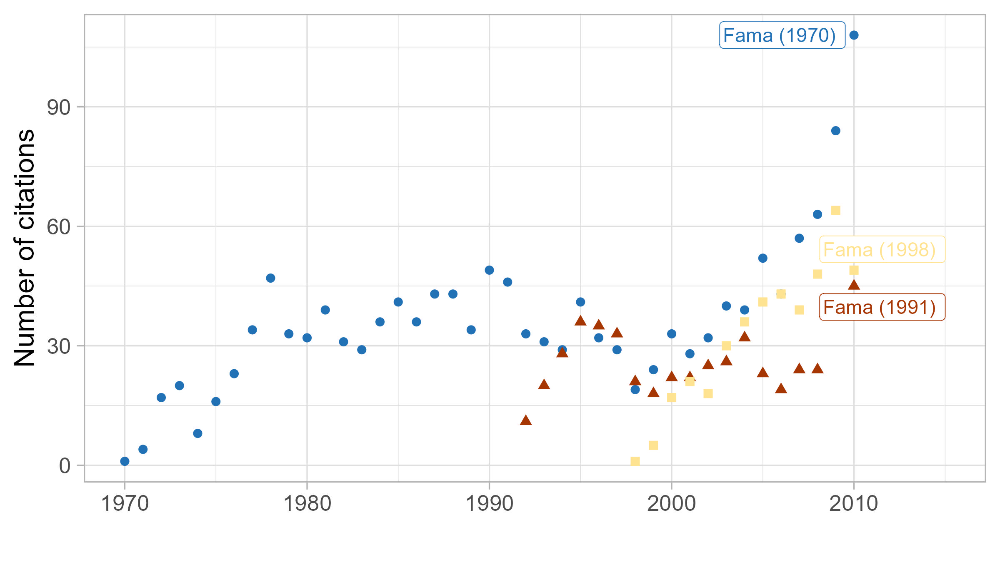
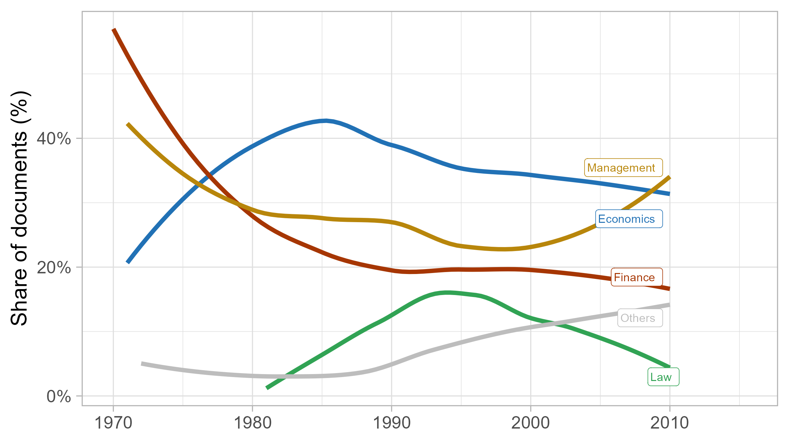
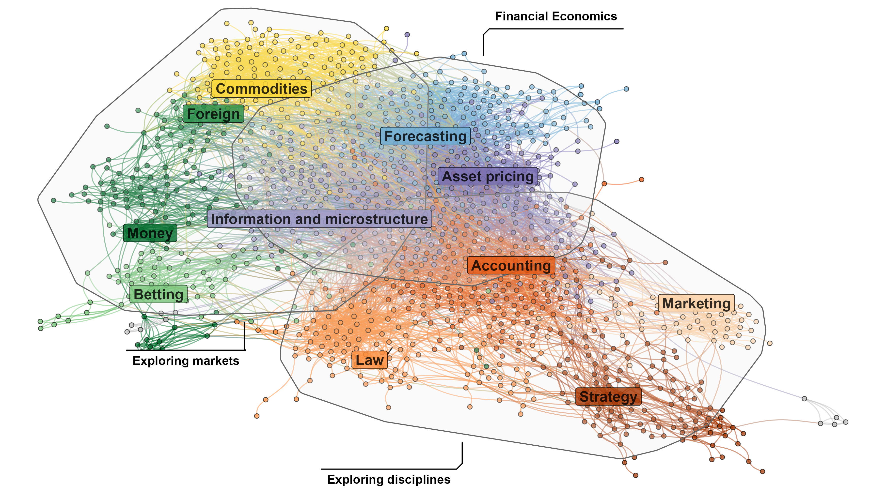
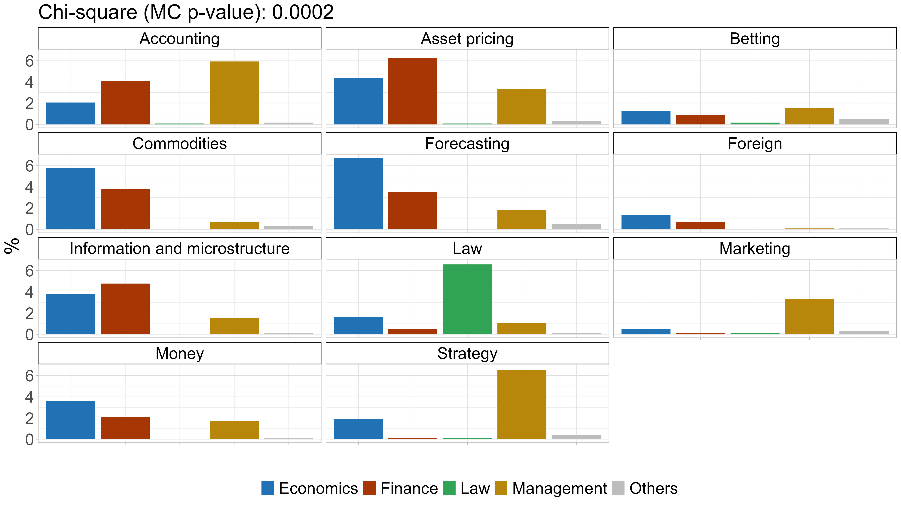
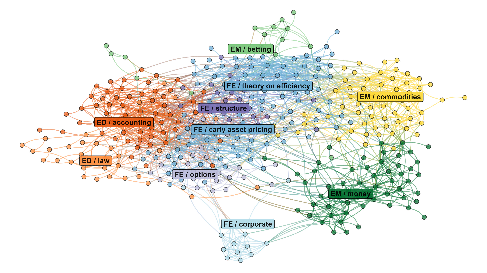
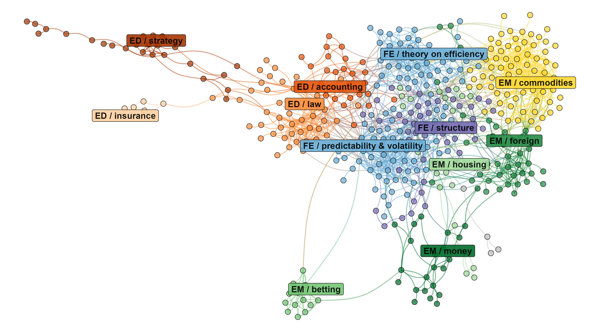
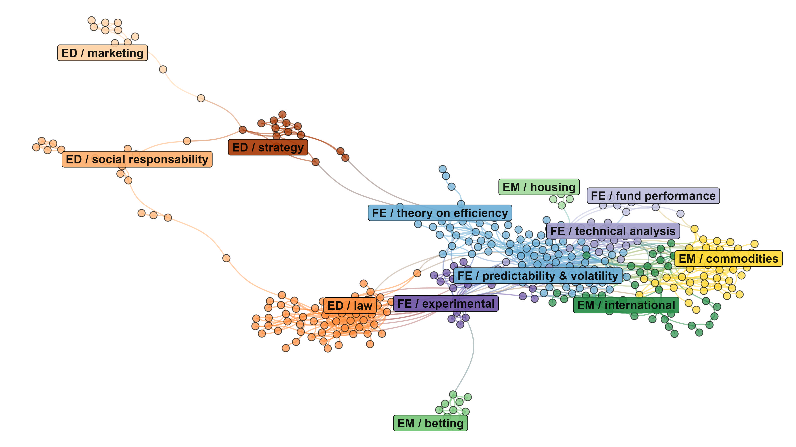
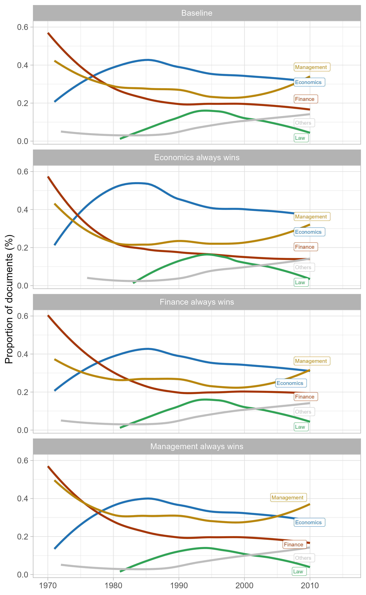

---
format:
  pdf: 
    abstract: "What is the life of a seminal paper? This article addresses this question by examining the dissemination of Fama (1970), which introduced the efficient market hypothesis. Using network analysis, I map the communities that cite Fama (1970) and track their evolution over time. I show that the paper became not only canonical in financial economics but also a reference in law, management, and marketing. Market efficiency was interpreted in multiple ways, from a testable hypothesis about prices to a working assumption for policy evaluation. Tracing these pathways, the analysis highlights the growing influence of financial economics across the social sciences in the second half of the twentieth century. The article also contributes methodologically by providing an interactive, open‑source platform to explore the networks and clusters."
    thanks: "Université de Bourgogne Europe, thomas.delcey@ebe.fr" 
    date: "2025-06-18" 
    indent: true 
    section-numbering: true
    fig-width: 8
    fig-height: 4.5
    fig-retina: 2
    # fig-pos: 'h'
    fig-cap-location: 'bottom'
    tbl-cap-location: 'bottom'
crossref: 
    fig-prefix: figure   
    tbl-prefix: table
biblio-style: apalike
execute:
  echo: false
editor_options: 
  chunk_output_type: console
---


```{r}
#| echo: false
#| warning: false

source(here::here("paths_and_packages.R"))

corpus <- readRDS(here(clean_data_path, "corpus.rds")) %>% filter(year <= 2010)
graph <- readRDS(here(clean_data_path, "graph_with_color.rds"))
selected_graphs <- readRDS(here(clean_data_path,  paste0("selected_graphs_", "15", ".rds")))
journal_classification <- readxl::read_excel(here(clean_data_path, "list_journal.xlsx"))

summary_table_static <- readRDS(here(clean_data_path, "summary_table_static.rds"))

time_windows <- c("1971-1985",
                  "1979-1993",
                  "1988-2002",
                  "1996-2010")

for (i in time_windows) {
  assign(paste0("summary_table_dynamic_", i), 
         readRDS(here(clean_data_path, paste0("summary_table_dynamic_", i, ".rds"))))
}

summary_table_dynamic <- readRDS(here(clean_data_path, "summary_15.rds"))

top_journals <- readRDS(here(clean_data_path, "top_journals.rds"))
top_authors  <- readRDS(here(clean_data_path, "top_authors.rds"))
top_articles <- readRDS(here(clean_data_path, "top_articles.rds"))
```

\newpage 

# Introduction

On October 14, 2013, Eugene Fama received the Nobel prize, together with Robert Shiller and Lars Peter Hansen. The Nobel committee's decision to reward Fama drew unusual media attention [@guardian_2013; @ft_2013; @nytimes_2013]. The world was just recovering from the great financial crisis and the prize honored the scholar who developed the efficient market hypothesis, a theory criticized for having overlooked financial instability. Commentators also emphasized that the prize rewarded both Fama and Shiller who happens to be one of his main intellectual critics. Shiller built his career in showing the shortcomings of market efficiency and by developing an alternative framework known as behavioral finance. Rewarding both scholars sent the signal that the debate was still open. Shiller himself was critical of Fama, which was uncommon for a fellow laureate. "I don't know if Fama ever states his theory really clearly", he said after the nomination, "if he did it might sound a little odd" [@guardian_2013]  

These reactions prompted essays from financial economists, who felt the necessity to justify the significance of Fama's contributions and to emphasize the complementarity with Shiller's [e.g. @campbell_empirical_2014]. One of those accounts was given by @cochrane2013eugene who criticized the idea that Fama's idea was too simple and vague. He argued that "the efficient-markets theory did not become famous because it is complex. The greatness of Fama's contribution lies in the fact that efficient-markets became the organizing principle for decades of empirical work in financial economics." "When you think of Fama, don't think of Einstein", he pursued "Think of Darwin, who also saw that a simple principle---evolution by natural selection---organized and gave purpose to a vast collection of facts."

The simple principle to which Cochrane is referring was the efficient market hypothesis (EMH), the idea that asset prices fully reflect all available information. It was popularized by Fama in a literature review published in the _Journal of Finance_ in -@fama_efficient_1970 (henceforth, Fama's review) that became a seminal article in financial economics. Like any literature review, this article became quickly outdated as new empirical evidence accumulated and new theoretical frameworks were developed; but the formulation of market efficiency proposed by Fama remained influential until today. As Shiller and Cochrane's comments suggest, the simplicity of Fama's formulation was both a source of praise and a target of criticism. But regardless of sides taken, that simplicity was arguably a key source in the success and influence of this article.

To gauge its popularity, I compute in the @fig-distribution the citations by the year of Fama's review and two other important and more recent articles by Fama on market efficiency. The 1991 article, also published in the _Journal of Finance_, was an explicit sequel to the 1970 review, where Fama reassessed the state of market efficiency in light of the developments in financial econometrics and the increasing challenges to market efficiency. @fama_market_1998 was an essay published in the _Journal of Financial Economics_ where Fama gave his perspective on the rise of behavioral finance. The figure shows how Fama's review remains the most cited article even decades after its publication. 

{#fig-distribution}

Such a pattern raises the question of why Fama's 1970 review remains so cited over time in comparison to its more recent and updated articles on the same topic. A first hypothesis is that the article was fueled by intellectual tension between supporters and critics of market efficiency. A second related hypothesis is that Fama's review was cited for historical purposes as one of the foundational articles of modern financial economics. In this perspective, Fama's review was cited not for its content but rather for its symbolic value as the origin of a research program. @jovanovic_construction_2008 argued for instance that Fama's review participates in constructing the "canonical history of financial economics" by providing a narrative of pioneers and key contributions.

There is some truth in those two hypotheses---as we will see later---but it also misses another important part of the story. A third hypothesis illustrated by @fig-distribution_discipline is that Fama's review disseminated far beyond financial economics. The figure shows the share of articles citing Fama's review by discipline over time. While in the early 1970s, most citations came from economics and finance journals, the following years saw an increasing share of citations from other disciplines especially from law and management. Additionally, the share of citations from finance declined over time, showing that from the early 1980s, the major part of the dissemination of Fama's review happened outside its original field. 

{#fig-distribution_discipline}

How did a finance review become a long-lived reference across such different communities? In this paper, I study the dissemination of Fama's review over time and across different communities of research. My goal is not to analyse the history of market efficiency as a whole or the influence of Fama as a scholar. It is the _story of a paper_ and the disseminations of its ideas across different communities of research. To study this dissemination, I use a mixed method that combines quantitative network analysis and qualitative reading of documents. I first use citation data from the Web of Science Core Collection to build the corpus of `r nrow(corpus)` published articles citing Fama's review from 1970 to 2010. I analyze this corpus using a statistical bibliographic coupling model---based on the stochastic degree sequence model [@neal2014backbone]---that groups documents based on the similarity of their references. This first quantitative step allows us to understand _who_ are the different clusters of documents in the corpus and how they evolve over time. Those clusters are not direct proxies for the use of the review itself: they capture the broader intellectual environment into which the review is absorbed. They are thus the starting point of the analysis rather than its end. This second step consists in a qualitative reading of documents to interpret each cluster. I focus here on _how_ the different clusters interpret and use Fama's review. In order to make this mixed method workflow transparent, I develop an interactive application that allows the user to explore the networks and information on each cluster on which the analysis is based.^[The application is available at [https://019c241f-91f4-a63b-1097-ed53083ffbbc.share.connect.posit.cloud](https://019c241f-91f4-a63b-1097-ed53083ffbbc.share.connect.posit.cloud) and can be locally run from the GitHub repository [https://github.com/tdelcey/research](https://github.com/tdelcey/research/tree/main/fama_1970)]

Of course, because of the centrality of Fama's review in the historiography of financial economics, this contribution is closely related to the history of market efficiency as a whole. But the citation data and the network could not capture the full history of market efficiency, whose nature is more complex than a contribution of a single paper and its citations. As the decline of citations in finance found in @fig-distribution_discipline suggests, Fama's review did not play a key role in the later debates in the core financial economics. Instead of focusing on the last advancements in financial economics, this paper offers a more circumscribed study on the diffusion of one of its foundational articles across a long period of time and various contexts. 

This case study is part of a broader literature on the dissemination of ideas in economics and science more generally. In the history of economics, the dissemination and (extradisciplinary) influence of scientific works has been increasingly studied with the development of bibliometric analysis [e.g., @truc2022interdisciplinary]. In the same perspective, this paper uses citation data not to study the making of a contribution but rather its dissemination and influence over time. Recent research on the philosophy of economics has focused on the transfer and translation of ideas across fields [e.g., @MorganStapleford2023; @Herfeld2024-HERMTI-2]. One important insight from this literature is that ideas are not simply passively transmitted from one context to another but are actively translated and reinterpreted in the process. @herfeld2019diffusion, for instance, argued that the diffusion of Von Neumann and Morgenstern's rational choice theory in economics involved a process of reinterpretation and adaptation to fit the other field's own tradition of research and field-specific problems. This paper builds on this insight by tracing how Fama's review and its ideas were translated and reinterpreted in different contexts over time.

One crucial difference from this existing literature is that the efficient market hypothesis is not a single, stable model or theory but rather a polysemic set of ideas [e.g., @delcey_samuelson_2019]. The qualifier "hypothesis" is itself ambiguous insofar as market efficiency can refer sometimes to a simple falsifiable empirical proposition and sometimes to a broader theoretical framework. @vuillemey_sur_2013, for example, mentions other "epistemological statuses" of market efficiency---different scientific functions than a same object can play in different contexts. In some contexts, market efficiency is treated as an empirical hypothesis that can be tested using econometric methods. In other contexts,  @vuillemey_sur_2013 argued that market efficiency is rather a system of (unfalsifiable) definitions that gives conceptual meaning to the price system. In this sense, for some of its readers, Fama's review was not so much about a testable theory of price behavior but a general framework to understand how markets work. This ambiguity of the epistemological status of market efficiency lies at the heart of the diversity of uses of Fama's review that we will observe in the remainder of the article.


# The review and its context 

When Fama published his review in 1970, financial economics was emerging as a distinct field within economics. Fama was one of the main actors of this emergence of the so-called field of financial economics. Since the early 1960s, Fama had been working on the statistical properties of asset prices and was one of earliest scholars to apply econometric methods to financial data. In his Ph.D. thesis completed in 1964 at the University of Chicago, Fama studied the behavior of stock prices and already coined the term "efficient market" to describe the rational behavior of prices in response to information [@fama_behavior_1965]. This was an intuition shared by many economists working on financial markets but most of these early contributions remained intuitive statements formulated in economic terms.^[ See for instance @telser_futures_1958; @working_new_1961; @cootner_random_1964. Pioneers are discussed in detail in @walter1996histoire; @delcey2025holbrook] But Fama was already discussing explicitly and in detail the implications of his findings for the work of portfolio managers and it attracted the attention of practitioners who published a short version of his thesis in the _Financial analysts Journal_ [@fama_random_1965]. 

As any emerging field, financial economics in the 1960s was characterized by a diversity of approaches and methods. While some scholars developed first theoretical models of asset pricing [e.g. @samuelson_proof_1965; @mandelbrot_forecasts_1966], most contributions were empirical studies without a unifying framework. The strength of Fama's review was to organize and reinterpret the existing empirical evidence within a unified and simple framework. In particular, he brought together two distinct bodies of empirical findings. The first consisted of statistical evidence on price series, suggesting that price changes were largely unpredictable and close to a random behavior. The second came from studies of trading strategies, which showed that even statistically sophisticated methods failed to generate persistent abnormal returns.

At the same time, Fama emphasized a third, more direct line of empirical investigation, which focused explicitly on the incorporation of information into prices. In his review, he discussed one of his recent work developing what would soon become known as the event study methodology. One year before the publication of the review, Fama and his coauthors proposed a new empirical procedure designed to examine how prices respond to clearly identified pieces of information. Instead of inferring market efficiency solely from the statistical properties of price series or returns, this approach selected specific information events, formulated hypotheses about the effect of those events on prices, and tested those hypotheses using price data. As @fama_adjustment_1969[1] argued, the aim was "to examine the process by which common stock prices adjust to the information (in any)," and not merely to "infer market efficiency from the observed independence of price changes."^[In the 1960s, test of independence was the main approach to test the random character of price changes.]

These three bodies of empirical findings, Fama argued, could be understood as tests of a single underlying and simple proposition: in a well-functioning market, prices should reflect all information available and relevant to market participants---a statement that Fama termed the efficient market hypothesis. The idea that prices reflect information was largely commonsense for most economists, but it attracted attention in finance because of its implications: it suggested that most trading strategies and much of the work of financial analysts were doomed to fail. As William F. Sharpe remarked in his discussion of Fama's review, the efficient markets hypothesis was "almost trivially self-evident for most professional economists," while it appeared "truly revolutionary to the traditional security analyst" [@Sharpe1970: 418] Fama distinguished three forms of market efficiency---weak, semi-strong, and strong---depending on the type of information that prices are assumed to reflect: respectively past (past price series), public (event studies), and private information (trading strategy). 

As @jovanovic_construction_2008 argued this simple classification created a continuum between various and heterogeneous approaches and helps to create a coherent and simple narrative. Moreover, most studies discussed by Fama overwhelmingly supported the efficient markets hypothesis and Fama logically concluded his review by stating that "the evidence in support of the efficient markets model [was] extensive and (somewhat uniquely in economics) contradictory evidence [was] sparse." [@fama_efficient_1970: 416] Beyond a summary of cutting-edge empirical methods that could easily be mobilized and reused, the review also offered a powerful historical narrative explaining how a series of empirical clues converged toward the same theory of financial markets. The review thus constructed, at least popularized, both a theory and its consensus.


# Building networks   

To study the dissemination of Fama's review, I use methods from bibliographic coupling and network analysis. Using the Web of Science Core Collection, I build a corpus of `r nrow(corpus)` published articles citing Fama's review from its publication in 1970 to 2010. I estimate a coupling network exploiting the data on the references of documents. In a coupling network, the nodes are documents and the edges are a measure of the proximity of their bibliography. The fundamental hypothesis of coupling analysis is that documents that share the same references are likely to be similar in their research. The coupling network is then a representation of the intellectual proximity between documents of the corpus. This method has been increasingly used in the history of economics to make sense of large corpora [@claveau_macrodynamics_2016; @truc_forty_2020; @goutsmedt2021stagflation]. I detail below the methodology used to build the coupling network. I focus on the motivation and general principles of the methods used and refer the reader to the appendix for technical details. The full analysis is implemented in `R` and is available on the GitHub repository [https://github.com/tdelcey/research](https://github.com/tdelcey/research/tree/main/fama_1970). 


## Coupling similarity

While the clustering analysis is based on bibliographic coupling, several other choices were possible. An alternative would have been co-citation analysis. In a co-citation network, two documents are linked if they are cited together by other documents. Co-citation analysis captures how future researchers relate documents to each other but not necessarily how those documents are related in their own context. Since the object of this paper is to study how authors of documents citing Fama's review relate to each other, bibliographic coupling is more suited to our purpose.^[A second alternative would have been to use textual data and group together documents based on semantic similarity. For the records, I also collected the full text of most of the documents in the corpus to extract the paragraph citing Fama's review. However, such textual data did not prove useful. Most of the time, the citation is perfunctory and a qualitative treatment on fulltext or citation context would not add much more than a qualitative analysis on how Fama's review and his ideas are used and understood in a given document and cluster.]  


One crucial aspect of coupling analysis is the measure used to estimate the proximity between documents. The simplest methods are measures derived from the raw count of shared references [@shen2019refined]. However, large networks tend to have noisy edges that can make the network too dense and difficult to interpret. One way to decrease the density of the network is to remove edges that are below a certain weight threshold. While being simple and computationally efficient, this method is also arbitrary and the level of the chosen threshold can strongly affect the network. I use instead the stochastic degree sequence model of @neal2014backbone that defines _statistically significant_ edges. Intuitively, the stochastic degree sequence model defines a null model where the edges are randomly distributed among the nodes while keeping each node's degree constant _in average_. The model then estimates for each edge the probability of observing its weight under the null model. If this probability is lower than a given significance level (here 1\%), the edge is considered statistically significant and kept in the network. This method thus keeps edges that are important and that represent the core structure of the network, also called the backbone, and thereby removing noisy edges.


## Clusters

In the context of coupling analysis, a cluster is a set of documents that share more references with each other than with the rest of the clusters. I identify clusters using the Leiden method [@traag_louvain_2019], an improvement of the Louvain method [@blondel_fast_2008]. This class of algorithms is a cluster detection method that aims at maximizing the modularity of a network. The appendix provides a formal definition of modularity but the idea follows the same intuition than the stochastic degree sequence model: modularity compares the observed density of edges within clusters to what would be expected from a random draws (even if in this case it does not involved a statistical test). A cluster with high modularity is a cluster where documents are more connected to each other than what would be expected by chance. Modularity optimization algorithms have been successfully used in the history of economics to identify consistent group of research in large networks [e.g. @goutsmedt2021stagflation; @truc_forty_2020]. 

In the history of economics, clusters are often interpreted as communities of research that share a common set of ideas, methods and values and are organized around a common set of institutions such as universities or journals. However, in the context of this paper, this interpretation might be misleading as the clusters do not necessarily constitute a full community but only a subset of documents citing Fama's review. In the dynamic analysis for instance, a rising (declining) cluster in the present analysis does not necessarily reflect the emergence (disappearance) of a community of research but rather the increasing (decreasing) dissemination of Fama through a set of common research. While a new cluster is often concomitant with the emergence of a community of research, we will see Fama's review stopped being cited by important communities of research. Those clusters disappear from the network but are still potentially active areas of research. 


## Static and dynamic analysis 

For historians, one issue with network analysis is that it is a static representation of the corpus. It does not capture the evolution of the corpus over time and it is harder to identify the emergence and disappearance of clusters. Moreover, given that the number of documents in the corpus is exponentially increasing after the 2000s, a single network representation over the entire period could be biased toward the most recent documents. 

To overcome this issue, I complement the static analysis with a dynamic analysis developed by @goutsmedt_networkflow_2022. The idea is to build a series of overlapping networks, each network representing a specific time window of length $T$. The first network $B_t$ is composed of documents published between $t$ and $t + T$, the second network $B_{t+1}$ is composed of documents published between $t+1$ and $t+T+1$, etc. The networks are thus overlapping and clusters tend to be similar between two neighboring networks. To capture this similarity, I merge a cluster $X$ in $B_t$ and a cluster $X'$ in $B_{t+1}$ if the share of nodes in $X$ that moved to $X'$ is greater than 50\%.^[The share is the proportion of nodes from $X$ that moved to $X'$, on the total number of nodes. Two approaches are possible to estimate this denominator: we can first divide by the total number of nodes in $X'$. But if there are many _new_ nodes in $X'$, this method may give a low proportion while most of the nodes in $X$ are still in $X'$. Another approach is to divide by the number of nodes in $X'$ _that are also in_ $X$, i.e. the number of nodes that were already present in the previous time window. We use this method since the number of documents increased over time.] 

While using a dynamic network is a good way to identify the evolution of clusters, it is not without drawbacks. The choice of the time window, $T$, is arbitrary and can affect the results. A too large time window will likely hide the evolution of the network and the short-term dynamics. On the other hand, a too small time window will likely lose an existing relationship between documents published in an interval greater than $T$. Moreover, dynamic analysis demultiplies the number of networks to analyze and can make the qualitative analysis more difficult. Even if two documents are published with an interval of 50 years, they may still share a legitimate cognitive relationship captured by the bibliographic coupling. I thus use _both_ the static network of the entire period (1970-2010) and four networks from a dynamic analysis with $T = 15$ years (1971-1985, 1979-1993, 1988-2002 and 1996-2010). I used dynamic networks as a robustness check of the static analysis and to better capture the evolution of clusters over time. The choice of a 15-year time window is a trade-off between a short enough window to capture the evolution of the network and a long enough window to ensure having enough documents in each network to capture existing relationships. I have selected the four time windows to cover the entire period from 1970 to 2010 with an overlap of 7 years between two consecutive windows.^[The application includes other time windows of 10 and 20 years as well as the static network. The main results---in particular, the dissemination of Fama's review in three areas of research---are robust to those different specifications.]


## Visualization 

I use the force atlas layout to spatialize the networks in two dimensions. The force atlas layout aims at minimizing the distance between nodes that are connected by an edge and maximizing the distance between nodes that are not connected. Logically, the layout tends to separate the clusters. For each network, static and dynamic, I remove isolated articles and small components (connected groups of nodes representing less than 5\% of network's nodes).^[ I did not exclude secondary network components---cluster of nodes that are not connected to the main component of the network--- but _de facto_ our networks have only one component.] In dynamic networks, the position of the node from the last time window is used to initialize the position of the nodes in the next time window. Except for major changes in the network, this initialization allows to keep nodes and communities in the same position over time and improves the readability of the network.

## Interpretation 

The method has several limitations that have to be kept in mind for the interpretation of the results. First, bibliographic coupling relies on data whose coverage and accuracy are imperfect. For instance, some non stantard references---such as a governement report---may be missing or incorrectly recorded while being influential in a given document. Other biases may arise from the coupling measure itself. For instance, citation practices may vary across disciplines and over time, which may affect ultimately the determination of clusters. Hence, clusters should not been interpreted as a definitive measure of Fama's review dissemination but rather as an informative first step to guide historical analysis. 

The historical analysis of each cluster is a back and forth process between the raw data and our classification system. One issue with this procedure is that it is subjective and hardly replicable. There is no one ultimate method to find what are the commonalities between documents and thus what a cluster is about. To make sense of a cluster, a researcher has to read the documents in the cluster and to identify the commonalities between them. This is a necessary process that can be influenced by the researcher's own background and knowledge. I employ several metrics to help this qualitative process. I first compute descriptive indicators based on key metadata of documents: (a) the tf-idf of titles, (b) the top journal (by frequency and tf-idf), and (c) the time distribution of documents in the cluster. The main input of the interpretation process is the nodes (documents) composing each cluster. In order to identify important documents in each cluster that could guide the reading, I used the role-based measure of centrality developed by @guimera2005cartography. This measure distinguishes three types of nodes: hubs (nodes with many connections within their cluster), connectors (nodes that link different clusters together), and peripherals (nodes with few connections, mostly within their own cluster). It helps to identify the most influential documents in each cluster based on features from the network structure rather than external criteria such as citation counts that may be biased by the age of the document or its field of research. For each cluster, I also the share of nodes identified as hubs and connectors to assess the cohesiveness of the cluster and its relationship with other clusters. A positive share of hubs indicates that the cluster is cohesive while a positive share of connectors indicates that the cluster is strongly linked to other clusters. A positive share of both hubs and connectors indicates that the cluster is a core part of the network.^[The @guimera2005cartography's methdology is presented in detail in the appendix.]

If quantitative metrics can help, they also imply several subjective choices to be made. To improve this process and make it transparent to the reader, I develop an interactive application that allows the user to visualize the clusters and to interact with the data. The application is available at [https://019c241f-91f4-a63b-1097-ed53083ffbbc.share.connect.posit.cloud](https://019c241f-91f4-a63b-1097-ed53083ffbbc.share.connect.posit.cloud). The user can select a cluster and see the documents that are in this cluster. Tables [-@tbl-summary_static; -@tbl-summary_dynamic_1; -@tbl-summary_dynamic_2; -@tbl-summary_dynamic_3] and [-@tbl-summary_dynamic_4] in the appendix give the summary statistics of the clusters for each network but the readers is strongly encouraged to use the application to explore the data and the clusters. 

Clusters' labels are chosen based on the reading of documents and the statistics computed for each cluster. The labels are not meant to be definitive but indicative and help to organize the discussion below. 

# Results 

@Tbl-summary_dynamic gives the number of documents for each cluster and the resulting number of nodes after the procedure. Because we focus on the backbone of the network, the number of nodes is lower than the number of documents. The documents that are not nodes are isolated documents with no significant relationship and are excluded from the analysis. To put it differently, the analysis focuses only on documents participating in a consistent group of research.


```{r}
#| echo: false
#| warning: false
#| tbl-cap: "Number of documents and nodes in each network."
#| label: tbl-summary_dynamic
#| tbl-pos: "h"

# table in latex 
dynamic_cluster_counts <- tibble(
  time_window = time_windows,
  n_clusters = sapply(
    time_windows,
    function(w) n_distinct(get(paste0("summary_table_dynamic_", w))$cluster_label[
      get(paste0("summary_table_dynamic_", w))$cluster_label != "Varia"
    ])
  )
)

table_dynamic <- summary_table_dynamic %>% 
  filter(time_window %in% time_windows) %>%
  select(n_nodes, n_documents, time_window) %>%
  left_join(dynamic_cluster_counts, by = "time_window") %>%
  rename("Nodes" = n_nodes,
         "Documents" = n_documents,
         "Period" = time_window,
         "Clusters" = n_clusters)

table_static <- summary_table_static %>% 
  summarise(n_nodes = sum(n_nodes)) %>% 
  rename("Nodes" = n_nodes) %>%
  mutate("Clusters" = n_distinct(summary_table_static$cluster_label[summary_table_static$cluster_label != "Varia"])) %>%
  mutate(Period = "1970-2010",
         "Documents" = corpus %>% 
                  filter(year < 2011) %>% 
                  nrow()) 

table <- bind_rows(table_dynamic, table_static) %>% 
  relocate("Period", "Documents", "Nodes", "Clusters")


table %>% 
  kbl(booktabs = TRUE, escape = TRUE) %>% 
  kable_styling(font_size = 8, latex_options = c("striped"))

```


::: {#fig-coupling_static style="text-align:center;"}



Static coupling network (1970-2010). This is the main component of the network with `r graph %>% activate(nodes) %>% as_tibble %>% nrow` nodes and `r graph %>% activate(edges) %>% as_tibble %>% nrow` edges. Nodes are documents, edges indicate statistically significant bibliographic coupling. The color of the nodes indicates the cluster to which they belong. The spatialization is done using the force atlas layout. Cluster labels are defined by the author. The circles delineate groups of clusters defined by the author. 
:::


@Fig-coupling_static is the static coupling network of the corpus for the entire period. 
While this network erases the temporal dimension of the corpus, it already gives important insights on the dissemination of Fama's ideas over the four decades. In particular, this dissemination spread in three directions, which I gather in three groups of clusters (henceforth meta-clusters). 

The first, and arguably the most expected one, gathers research in the core of financial economics. It is mainly composed of documents that focus on the development of the asset pricing analysis and are published either in the top journals in economics and finance---i.e., _the Journal of Finance_, _the Journal of Financial Economics_. This core group includes three clusters. The cluster 'Asset Pricing' is dedicated to the theoretical and empirical development of asset pricing models, including the Capital Asset Pricing Model (CAPM) and the Arbitrage Pricing Theory (APT), which are foundational to modern finance. It is also a critical examination of Fama's review, which extensively documents empirical deviations from traditional asset pricing models and the EMH, highlighting various empirical anomalies. Completing this foundational group of financial economics is the cluster 'Information and microstructure', which delves into the theoretical underpinnings and practical mechanics of price formation, examining information asymmetry and trading processes. The cluster also includes experimental evidence that contributes to understanding the limits and actual attainment of market efficiency. Finally, the cluster 'Forecasting' directly engages with one central argument of Fama's review, which is that price changes are unpredictable and cannot be forecasted. This literature gains momentum in the late 1990s and early 2000s and reevaluates the challenges of forecasting, often in the context of technical analysis. While the cluster includes contributions in the core journals of finance, it also extends to specialized and applied journals, such as _The Journal of Forecasting_.

The second group, 'Exploring markets', gather communities applying the framework of Fama's review to other markets. It is mainly composed of documents that sought to apply Fama's framework to other assets such as agricultural markets and published in specialized journals in finance and economics---i.e., _The American Journal of Agricultural Economics_ or _the Journal of Futures Markets_. This group is exemplified by the cluster 'Commodities', which rigorously tests various forms of the EMH in commodity and futures markets for items like oil, gold, and agricultural products, often employing specialized econometric techniques. The cluster 'Foreign' specifically examines the efficiency of foreign exchange markets, testing parity conditions and the predictive power of forward rates. Furthermore, the cluster 'Money' investigates the intricate linkages between broader macroeconomic variables and monetary policy. It examines how markets process macroeconomic information and whether asset prices efficiently reflect these factors. Finally, the cluster 'Betting' extends Fama's framework to unconventional settings like wagering and prediction markets, assessing how these specialized markets aggregate information and forecast future events related to sports and even, in the recent years, politics. 

The third group of clusters are research in other disciplines, in particular, in law and management. This literature uses the EMH to investigate internal issues within their disciplines. Logically, the main journals are specialized journals in management and law such as _The Journal of Law and Economics_ or _The Journal of Accounting_. The 'Accounting' cluster is at the intersection of finance and accounting---we will see that it is mostly exportation of methods from financial economics to the accounting literature. The cluster 'Law' gathers legal scholars scrutinizing securities regulation and corporate governance through the prism of market efficiency. The cluster 'Strategy' involves management and strategy researchers utilizing market reactions to evaluate the impact of corporate strategies, social responsibility initiatives, and governance. Lastly, the cluster 'Marketing' applies market-based valuation to assess the financial returns of marketing policies such as marketing campaigns, brand building, and customer satisfaction efforts. 


The main contribution of the static network is to show that the dissemination of Fama's review and its ideas is not limited to financial economics but also extends to other fields of economics and disciplines, such as law, accounting, management and marketing. The clusters are consistent with the discipline distribution of documents in the corpus illustrated in @fig-field_communities. Documents published in finance journals are mostly concentrated in the first meta-cluster 'Financial economics' and can also be found in important connected clusters from the periphery such as 'Commodities' and 'Accounting'. Documents published in economics journals are mostly distributed among clusters in the left periphery 'Exploring markets' but can also be found in the core financial economics clusters. Finally, documents published in other disciplines such as law and management are mostly concentrated in the right periphery 'Exploring disciplines'. 


These results are also robust to the dynamic analysis. The dynamic networks reveal the same core-peripheral structure, with a central meta-cluster in financial economics and two peripheral meta-clusters, either applying market efficiency to other markets or other disciplines ([@fig-coupling_d1; -@fig-coupling_d2; -@fig-coupling_d3;-@fig-coupling_d4]). In dynamic networks, I attribute an acronym (e.g., FE for Financial Economics) to each cluster's label to indicate the meta-cluster they belong to. For clarity, I attribute the same set of colors to clusters that are similar between the static and dynamic networks (for instance, clusters in financial economics are variations of blue and purple). Because the dynamic networks are shorter in time, the clusters are more precise in their definition and the labels are more specific. For instance, the 'asset pricing' cluster from the static network is split into several clusters in dynamic networks. In the 1971-1985 network, we find the cluster 'Early asset pricing' that regroups foundational work on asset pricing, including the CAPM and the Arbitrage Pricing Theory. In the following 1979-1993 and 1988-2002 networks, the cluster 'Predictability & volatility' indicates the emergence of a new community in asset pricing that is more critical of market efficiency and reflects the well-known controversy on market efficiency. 


# Discussion: the various disseminations of Fama's review

The summary of the network analysis in the preceding section reveals a broad and multifaceted dissemination of Fama's review, organized in a distinct core-peripheral structure. A central aspect of this story is that Fama's review served three different intellectual purposes depending on the community of research. In the core of financial economics, Fama's review was interpreted as providing an empirical hypothesis. Despite being quickly challegend, the EMH was interpreted in a classical Popperian way as a testable proposition about the behavior of asset prices. This traditional interpretation of the EMH was also found in the peripheral communities that applied Fama's framework to other markets, such as commodities and foreign exchange. Fama's review became also cited in the core financial economics as the foundational reference of a general understanding of how markets work. In those clusters, Fama's review was cited not as the foundation of an hypothesis describing price behavior but rather as a theoretical premise describing price and market functioning---an epistemological status that @vuillemey_sur_2013 termed a "system of definitions". Finally, in peripheral and external disciplines such as law and management, Fama's review was mobilized as working hypothesis that helps to investigate specific issues within those disciplines. In those contexts, the EMH was not meant to be tested but rather assumed as true to explore the implications of market efficiency for issues such as securities regulation, corporate governance, and marketing policies. 


## An empirical hypothesis in finance 

The most obvious and central explanation of the dissemination of Fama's review is its role as an empirical hypothesis in financial economics. In this context, the EMH was interpreted as a testable proposition about the behavior of asset prices and provided a foundational framework for research in asset pricing. 

In the 1970s, the EMH was closely related to the development of other asset pricing model, as shown in the core clusters 'Early asset pricing' and 'Option' in the 1971-1985 network (@fig-coupling_d1). While asset pricing models sought to explain the relationship between risk and return, the EMH gives a general explanation of how prices were rationally formed in a functioning market. One crucial document in the cluster 'Early asset pricing' was @fama1973risk[612], who introduced a benchmark methodology for testing the validity of the Capital Asset Pricing Model that will be widely used in the following decades. While developing a convenient cross-sectionnal test of the CAPM, @fama1973risk[607] also insisted that such procedure requires to assume a "perfect capital market" with "neither transactions costs nor information costs". Such "underlying assumption of a perfect market" was for the author equivalent to "a capital market that is efficient in the sense that security prices at any time 'fully reflect' available information." Prompted by Fama himself, the EMH and theoretical models was thus viewed as two side of the same coin. An asset pricing model was necessary to test the EMH---the famous idea of the joint hypothesis---and the EMH was also used to justify model assumptions (such as the independance of returns). More broadly, the EMH was in the mind of many modelers in the early 1970s and Fama's review was a natural reference point to be cited for many of them when discussing frictionless and rational markets [e.g. @merton1973intertemporal].

The 'Early asset pricing' cluster also includes early studies refuting the hypothesis. One of the first and famous example was the "January effect" identified by Michael S. Rozeff and William R. Kinney -@rozeff1976capital. They showed that average return of the New York Stock Exchange was significantly higher in January than in other months, implying a predictable pattern in stock returns that contradicted the EMH. In the 1970s, this kind of departures from the prediction of the EMH was not viewed as serious refutations of the theory but rather minor issues. @rozeff1976capital[396] themselves concluded that "it is unlikely that seasonality in stock returns will raise any serious problem for the efficient market model."^[ The climax of this view was the introduction of a special issue gathering refutations of the EMH by Michael C. @jensen_anomalous_1978. Jensen qualified those departures as "anomalies" and famously argued that "there is no other proposition in economics which has more solid empirical evidence supporting it than the Efficient Market Hypothesis." (95).] 

The criticisms intensified in the 1980s within the core of financial economics as shown by the cluster 'Volatility & predictability' in the 1979-1993 and 1988-2002 networks (@fig-coupling_d2; @fig-coupling_d3). The debate moved beyond contained, seasonal patterns like the "January effect" to more fundamental and powerful challenges to the rationality of the market itself. Empirical attacks on the EMH went on two fronts, the first one was the excess volatility of asset prices, which was famously initiated by @shiller1981stock. This literature questioned the rationality of the market by showing that observed asset prices seemed too volatile to be explained by fundamentals. The second front was the development of new econometrics tests, which was initiated by @lo1988stock and @poterba_mean_1988, which showed the predictability of returns and the existence of long-term patterns in asset prices. It was complemented by studies identifying short-term predictability, such as the evidence for one-week return reversals in @jegadeesh1990evidence and @lehmann1990fads. 

In the following decades,  this dialogue would lead to the development of behavioral finance that challenged the rational price formation implied by the EMH. However, Fama's review did not disseminate in this literature, as reflected by the small size of the community 'Behavioral' in the 1996-2010 network (@fig-coupling_d4).^[There are at least two reasons that can explain this absence: first, it is possible that the discussions (and the associated citations) focused on more recent work, including Fama's own [@fama_permanent_1988, @fama_efficient_1991]. And it is also possible that behavioral finance researchers strategically chose to no longer refer to a theoretical framework they considered outdated. @thaler_end_1999, for instance, advocated the "end of behavioral finance" by arguing that behavioral finance should no longer be considered as an alternative but was becoming traditional finance itself.] The review became a canonical reference but only occasionally cited for historical purposes, as the original framework of Fama's review became outdated. The transformation of Fama's review as a canonical reference is also reflected in the cluster "critical / perspective", which gathers retrospective and critical essays on finance, in which Fama's review appears as one of the central reference for the emergence of modern finance. We find in this community retrospective and methodological essays from prominent scholars such as Joseph @stiglitz2000contributions but also research in other disciplines with an interest in the history of finance [@mackenzie2003equation; @jovanovic_construction_2008]. 

After 2000, Fama's review remains a well cited reference in a literature testing the EMH centered on technical analysis (@fig-coupling_d3, @fig-coupling_d4). Less identified in the core of financial economics, this cluster gathers heterogeneous research interested in finding trading rules using sophisticated statistical methods---what Fama's review called the weak form of the EMH. Some research remained published in the top journals in finance but also in specialized journals such as _Journal of Economic Dynamics & Control_, _Expert Systems with Applications_, and _Journal of Forecasting_. As statistical methods became more sophisticated, the cluster evolved to include a wide range of empirical methods, from traditional econometric tests to machine learning and artificial intelligence. But maybe the most important change is that the community shifted from a normative stance (is technical analysis a profitable trading strategy?) to a descriptive one (why is technical analysis used?). This shift is exemplified by the work of Lukas Menkhoff [@menkhoff2007obstinate; @menkhoff2010use], which investigates the behavior of fund managers and professionals, treating technical analysis as a sociological and psychological phenomenon to be explained and to be included in asset pricing models. 

While behavioral finance challenged the rational price formation, the cluster 'Technical analysis' shows that the EMH remained an important empirical hypothesis regarding the forecastability. In 2007, @park2007we[787] argued that "academics tends to be skeptical about technical analysis", a skepticism that was explained by the still important "acceptance of the efficient market hypothesis (Fama, 1970), which implies that it is futile to attempt to make profits by exploiting currently available information such as past price trends." If the implicite rational price formation of Fama's review was contested, market efficiency was still a central empirical baseline regarding the profitability of trading strategies.


## An empirical hypothesis in other markets  

Fama's review found a new audience in other fields of economics. Here, the EMH was mostly used as a ready-to-use empirical hypothesis to analyze markets subject to speculation. This dissemination is mostly captured by the meta-cluster 'Exploring market' in the static network (@fig-coupling_static). 

One natural application of Fama's ideas was the commodities market and this happened as early as the early 1970s (@fig-coupling_d1). Research in commodities referring to Fama's review remained important over the entire period with a peak in the 1980s.^[In the 1990s, it was also extended to other products, especially metal and energy (@fig-coupling_d3; @fig-coupling_d4).] The quick adoption of the EMH in agricultural economics was explained by the intellectual proximity between both fields. Futures agricultural markets had been studied by American and British economists since the 1920s. A central issue was the role of expectations in the relationship between the spot and the future price. One of the most prominent figure among American agricultural economists, Holbrook Working, had formulated hypotheses consistent with Fama's theory, by suggesting that future prices were an unbiased estimation of expected spot prices [@delcey2025holbrook]. Working's idea was well-known in agricultural economics and the proximity of his ideas with those of Fama was obvious for specialized scholars [@leuthold1979semi: 483]. Moreover, agricultural economists were applied researchers who conducted empirical analysis and shared with financial economists a common interest in the econometrics of price series. The quality of the data was particularly good in agricultural economics since the 1930s, when the United States Department of Agriculture started to collect data on agricultural prices [@DelceyNoblet2024]. Hence, agricultural markets have been a natural object of study for early financial economists. From the 1970s, the weak-form and semi-strong forms developed by Fama were applied to commodity data and have structured research on this issue for the next decades [@carter1999commodity: 231-233]. From the mid-1970s to the 1990s, standard questions were those raised by Fama's review: the profitability of trading strategies in the commodities market and the impact of public information on prices. 

Another early connection between financial economics and other economic fields was macroeconomics. The network analysis shows how Fama's review disseminated in the 1970s and 1980s in the context of monetary economics and the study of foreign markets (@fig-coupling_d1). As for agricultural economists, the intellectual proximity between finance and macroeconomics facilitated the rapid dissemination of Fama's framework. The similarity between the rational expectation hypothesis and the EMH was well-known [@delcey_efficient_2023]. For instance, Thomas Sargent, in the cluster _Money_ of @fig-coupling_d1, saw in the large empirical support for market efficiency a justification for using the rational expectations hypothesis [e.g. @sargent1973rational: 539]. Financial economists were also interested in investigating issues traditionally studied by macroeconomics. In the 1970s, the central issue was the relationship between asset returns and inflation that was prompted by the oil shocks [@nelson1976inflation; @lintner1975inflation]. 

Either in agricultural economics or macroeconomics, Fama participated himself to the dissemination of his review by publishing articles in which he explicitely appropriated a specific field question through the prism of market efficiency [@fama_short-term_1975; @Fama_French_1987; @fama1984forward]. One of his most important contributions was a study of interest rates and inflation [@fama_short-term_1975]. This paper exemplified how the EMH changed the traditional way of thought in macroeconomics [@campbell_empirical_2014]. In the early 1970s, a standard macroeconomic question was to explain the level of interest rates. Many ideas were proposed to explain the level of interest rates, such as the Fisher effect, the liquidity preference theory, or the expectations hypothesis. For macroeconomists, it was natural to use the interest rate as the dependent variable. @fama_short-term_1975 did the opposite and suggested using the interest rate as the explanatory variable. Within the EMH's framework, it was natural to think that the interest rate was a price containing any information about factors that could affect its future level. Fama tested this idea by trying to predict the future inflation rate by using the current interest rate.^[The EMH predicted that the regression coefficient of the interest rates should be 1 since any information about the expected inflation was integrated into current prices. Any other past variables used as explanatory variables such as past inflation should have a coefficient close to 0.]


The popularity of research in the metacluster exploring market peaked in the 1980s (@fig-coupling_d2). But this vector of dissemination remains important over the entire period, even after the 2000s (@fig-coupling_d4). The cluster _Betting_ is perhaps the most blatant illustration of the ability of Fama's review to be used to explore new markets. From the 1980s, Betting markets were perceived as an interesting case study to analyze behaviors under uncertainty but with a simple institutional arrangement than that of more complex financial markets. Despite being already disputed in finance, the EMH was viewed as a useful empirical hypothesis to analyze those markets. In his review of the topic, Raymond D. @sauer1998economics praised the framework of Fama as a "flexible empirical tool" and added that "[t]he optimality of learning in a stochastic environment, the nature of the error term in pricing models, and the identification of informed trading are examples where the concept of market efficiency has been creatively employed." The economics of wagering markets was of course a niche research program but became an important cluster after 2000, prompted by sports and election betting.

In all those fields, one important popular element of Fama's review was the event study methodology. In agricultural and macroeconomics, event studies were regularly used to study the effects on prices of central bank or government reports.^[See, for instance, @jones1998macroeconomic; @plosser1982government; @mishkin1982monetary; @colling1990reaction; @grunewald1993live; @mcnew1994informational] The idea behind using event studies was originally to test the ability of the market to react quickly to public information. It thus relied on the assumption that a specific public information had an effect on prices. But the event study was also used in an opposite way, given market efficiency, what was the value of public information? @carter1999commodity[234], for instance, argued that most event studies in agricultural economics concluded that price reacted efficiently to the publication of the Department of Agriculture's reports, but since the publication of the reports had an effect, they also concluded that "the reports might have economic value" [@carter1999commodity: 234]. 

Beyond its role in framing empirical research, this last example illustrates how Fama's review and its famous maxim that price reflected information became also interpreted differently. Not only as an hypothesis that could be tested but as something that could be hold as true and used to derive implications. 

## A theoretical premise


One important vector of dissemination of Fama's review that departed from empirical testing was the development on information theory and market microstructure. In the static network, this is mostly captured by the cluster 'Information and microstructure' (@fig-coupling_static). In dynamic networks, the equivalent is the cluster `Theory on efficiency', which exists over the entire period. In both cases, because they gathers important theoretical contributions in finance, those clusters are logically located close to the core of financial economics.

In his early years, "Theory on efficiency" gathers documents that sought to understand how the dissemination of information and its aggregation into prices was actually taking place in markets (@fig-coupling_d1; @fig-coupling_d2). What does it mean that prices reflect information in case of information asymmetry? And how does the market aggregate these dispersed sets of information? One of the earliest to address those questions was Fama himself. @fama1971information emphasized that the EMH was silent on how exactly the information was generated and aggregated into prices. "There has been much work documenting the speed of adjustment of security prices to new information", they argued, "[s]o far, however, this `efficient' markets literature has had little to say about the process of information generation itself" [@fama1971information: 289].

This question became prominent only a decade later with the rise of rational expectations models that offered a framework to analyze how agents acquire and process information. @grossman_impossibility_1980's famous paradox was famously critical of the EMH by showing a _contradicto in terminis_ of Fama's definition. Far from any empirical consideration, the argument offered a particularly incisive internal critique: if markets are efficient, then there is no incentive to acquire information, but if no one acquires information, markets cannot be efficient. Efficiency implies the inexistence of the mechanism that makes it possible. They understood the contribution of Fama's review not as an empirical hypothesis to be tested, but as a theoretical premise whose logical consequences led to a contradiction. Referring explicitly to the review, they wrote: "Efficient markets theorists seem to be aware that costless information is a _sufficient_ condition for prices to fully reflect all available information; they are not aware that it is a _necessary_ condition But this is a _reducto ad absurdum_, since price systems and competitive markets are important only when information is costly" [@grossman_impossibility_1980: 404].

While @grossman_impossibility_1980 were particularly critical, others treated market efficiency as a promising starting point for studying how prices aggregate dispersed information.^[See @hellwig1980aggregation; @diamond_information_1981; @holden1992long] For instance, @hellwig1980aggregation opened by citing Fama's dictum that "price reflect all available information," and then noted that "if there is only one piece of information to consider the meaning of this phrase is unambiguous" but "problems arise when there many agents with different pieces of information". In that case, "the equilibrium price vector corresponds to some agreagate of all the individual pieces of information. Then the question arises how this aggregate is formed." [@hellwig1980aggregation: 478].

The cluster 'Theory on efficiency' remained an important cluster in the later networks, underlining that Fama's review continued to play a role in the theoretical discussions on market efficiency. However, from @fig-coupling_d1 to @fig-coupling_d4, the position of the cluster in the networks shows how these discussions move away from economics and get closer to research in accounting, as discussed below.

In dynamic networks, another important cluster aiming at to develop the insights Fama's review. But rather than focusing on the information aggregation process, those contributions focused on the impact of what is known today as the market structure. They questioned how trading and the matching of supply and demand actually took place. In one of the most famous contributions" of this cluster, Lawrence R. Glosten and Paul Milgrom argued that matching supply and demand was not a given but required institutional arrangements that were specific to each exchange:^[See @mackenzie2021trading for a socio-history of floor traders and market making.]


> The usual economic view of markets is as a place where buyers and sellers
come together and trade at a common price, the price at which supply equals
demand. Securities exchanges are often singled out as excellent examples of
markets that operate this way. In fact, however, trading on exchanges takes
place over time, and some institutional arrangements are necessary to help
match buyers and sellers whose orders arrive at different times. On exchanges
like the New York Stock Exchange, the economic function of the specialists
and the floor traders is that of middlemen: they hold the inventories that
facilitate trade when trading occurs over time [@glosten1985bid: 71]

\noindent  The motivation of this literature on market structure was theoretical and normative; the goal was to determine the optimal trading system. It was also descriptive and empirical as friction in trading systems could explain puzzles in the behavior of asset prices. In a review on this issue, @cohen1980implications[250] argued that various empirical phenomena could be explained by "friction in the trading process causing a bid-ask spread [the difference between the higher buying order and the lowest selling order] and price-adjustment delays that differ systematically across securities." 

In the 1990s, this set of research progressively stopped referring to Fama's review and the clusters disappears from the networks. One reminiscence, however, of this research was the cluster 'Experimental' in the 1988-2002 network (@fig-coupling_d3). The cluster gathered research that used the newly developed experimental methods to simulate trading systems in laboratories. The research was empirical and includes famous experimental evidence that contributes to understanding the limits and actual attainment of market efficiency [@smith1988bubbles]. But beyond the validation of the EMH, this experimental literature shared the same interest in the trading system and the aggregation of information as previous research. The laboratory allowed researchers to control the information set possessed by subjects and to test the impact of different trading systems on the behavior of asset prices. 

The clusters on information and microstructure disappear in the 2000s showing that Fama's review was no longer a central reference in the 2000s (@fig-coupling_d4). But we saw that the development of those fields was influenced by Fama's insights on information. One common element in those various research programs was a critical stance toward the EMH and the motivation to develop the too simplistic idea that prices reflect information. The statistical behavior of asset prices---on which Fama's focused---was the final outcome of a still poorly understood process that had to be unraveled. Retrospectively, @milgrom2021auction[1384-1385] acknowledges the role of the EMH and its limits on the development of the market design literature:

> Much of the early auction research focused on questions related to the information content and the level of prices. How much of the bidders' information comes to be reflected in the prices that are paid? If a lot of information is reflected in prices, how does that affect the ability of bidders to profit? Do some auction rules lead to systematically higher expected prices than others? The information problem took on a special urgency following the publication of an influential paper by Grossman and Stiglitz (1980). [...] For auction theorists, this paradoxical finding just reinforced our belief that general equilibrium theory was the wrong platform to use for studying market clearing among investors with private information.

\noindent The dissemination of ideas in Fama's review in the 1970s and 1980s was thus not only through a classical scientific discussion in which theory is set up and then tested and challenged by empirical evidence. While the EMH was a hypothesis to be tested, for those economists, it was rather a premise---prices are entities reflecting information---that needed to be developed. In a way, they were critical of the EMH but they also adopted the same worldview described by Fama's review: a worldview in which market participants compete for acquiring information that would be aggregated into prices.

## A working hypothesis

The dissemination of Fama's review extended to an even broader periphery, reaching beyond economics into disciplines like management, accounting, and law. In the meta-cluster 'Exploring Disciplines', which forms the other periphery of the static network (@fig-coupling_static), the EMH was often neither debated nor tested but adopted as a working assumption. In other words, the ability of EMH to explain the behavior of stock prices was mostly taken for granted, and the focus was on using it to derive new implications for their own fields. The dissemination of Fama's review in accounting and law began as soon as the early 1970s (@fig-coupling_d1).  Fama did not personally contribute to this dissemination, but his students and colleagues from the University of Chicago played a central role in this story---such as Jeffrey F. Jaffe, Ray Ball, Philip Brown, Ross Watts, George J. Benston, James Ellert, William Henry Beaver, and William Schwert.

The connection between finance on the one side and accounting and law on the other side was facilitated by the close relationship between these disciplines in Fama's university. More generally, the rise of business schools in the 1970s, with their interdisciplinary approach, facilitated the integration of finance into other disciplines of management [@fourcade_social_2013]. The link between finance and accounting was particularly strong in the context of event studies: among the many events that could affect stock prices, the publication of financial reports was a central and natural one. An important paper was from two of Fama's doctoral students, Ray Ball and Ross Watts, titled "Some Time Series Properties of Accounting Income" [-@ball1972some]. Ball and Watts were pioneers in the econometric analysis of accounting data and its relation to financial data. The first study on this question was published in 1968, before the publication of Fama's review, but Fama's theoretical framework and the event study methodology were already being discussed at Chicago. Ball, along with Philip Brown [-@Ball1968empirical], another Chicago student, conducted an event study using corporate accounting data. This article is now considered one of the canonical papers in modern accounting research and pionnered of "market-based accounting research" [@LevOhlson1982; @ball2014ball].

These works extended Fama's research program not for their results but for their methods. For instance, some studies showed that markets did not fully incorporate accounting data, constituting a refutation of strong-form market efficiency [e.g., @ball1972changes]. But for accounting scholars, the research objective was not to test market efficiency but to study accounting practices and policies. Event-study methodology could be used to test efficiency given a hypothesis about the price impact of information, but it could also do the reverse: given efficiency, one could evaluate the economic usefulness of an item of information or an accounting practice. @Ball1968empirical[159] introduced this perspective by arguing that "accounting theorists have generally evaluated the usefulness of accounting practices by the extent of their agreement with a particular analytic model," and adding that "the shortcoming of this method is that it ignores ... the extent to which the predictions of the model conform to observed behavior." In contrast, they suggested that the "behavior of security prices" could provide "an operational test of the usefulness" of accounting information. 

Fama's review and the reported consensus on market efficiency thus provided accounting researchers with a working hypothesis that allowed scholars to rank accounting systems, assess the usefulness of accounting information, and evaluate the effects of regulation through observed price reactions [@LevOhlson1982, 252-256]. By adopting the event study methodology, these studies cemented the method of Fama's review as a the new standard in accounting research. Accounting researchers described this shift as a form of scientization, moving away from a deductive and normative approach---which sought to define good accounting practices---towards a positive and empirical approach---which aimed to define the consequences of accounting practices before judging their desirability. In 1972, @ball1972some[4] argued that "[m]ost of the available empirical research on changes in accounting techniques attempts to establish reasons for, rather than consequences of, accounting changes."^[See @oler2010characterizing[641] for a retrospective]  This new program was so successful that it not only spurred the creation of pioneering journals like the _Journal of Accounting Research_,^[As an anecdote, @Ball1968empirical was rejected by the dominant journal of the time, the _Accounting Review_, and was published without referees in the _Journal of Accounting Research_.] but also dominated the leading journals in finance, such as the _Journal of Finance_, the _Journal of Financial Economics_, and the _Journal of Business_.

In strategic management, this approach was adopted later and in a more fragmented way. Starting in the late 1970s and throughout the 1980s, strategy researchers began to adopt the event study methodology to assess the impact of strategic decisions on shareholder value. The topics were varied, ranging from the impact of corporate social responsibility [@alexander1978corporate], mergers and acquisitions [@schwert1996markup], or CEO succession [@reinganum1985effect] on stock market performance. These works in strategy were published in a wider range of journals, including general management journals (_Academy of Management Journal_) and specialized ones (_Strategic Management Journal_). 


This diffusion also occurred in marketing but later. While the first studies applying financial methods to marketing decisions appeared in the late 1970s [@reilly1977advertising], the trend accelerated significantly in the 1990s (@fig-coupling_d1). Marketing researchers primarily used these methods not just to assess general corporate actions, but to quantify the financial value of their own core concepts, such as brand equity [@simon1993measurement], celebrity endorsements [@agrawal1995economic], and later, customer satisfaction [@anderson2004customer]. This research found a strong institutional home within the discipline's own leading journals, such as the _Journal of Marketing_, _Marketing Science_, and the _Journal of Marketing Research_.^[This approach was not as successful as it has been in accounting. The financial approach to the brand equity was rivaled by the more popular "customer" approach, which used surveys to determine the value of a brand on the basis of consumers' knowledge and their attitudes toward it [see @rojas2022review]. Still, this integration fostered the development of a recent subfield in marketing known as the "marketing-finance interface" [@edeling2021marketing].]


The network analysis also shows that Fama's ideas disseminated into financial law, a process in which scholars from the University of Chicago played again an important role. Throughout the 1970s, a wave of economic studies laid the empirical groundwork for this migration. One of the pioneering studies was Benston's critique of the SEC's disclosure requirements, in which he argued that the 1934 Act---requiring public companies to disclose financial information---had no measurable effect and thus was unnecessary [@benston1973required]. Benston studied a group of companies subject to the regulation and a group not subject to the regulation and concluded that "the 1934 Act had no measurable effect on the residual market prices of companies that did and did not disclose their sales." The results, he argued, were "consistent with the hypothesis that the market was efficient before the legislation was enacted" [@benston1973required: 152]. In other words, for Benston, prices already discounted the information that the SEC sought to mandate through disclosure. This approach was reproduced and systematized by researchers such as G. William Schwert and Gregg Jarrell [@schwert1981using; @jarrell1981economic]. As in accounting, this approach was advocated on the same scientific grounds: rather than debating the normative merits of disclosure regulation, one could empirically evaluate its effects on stock prices. For instance, Schwert promoted the use of event studies as a "positive analysis of government regulation" [@schwert1981using: 121]. This critique found resonance in legal circles [@kripke1979sec]. This line of research was so influential that in 1980, the SEC explicitly prompted a reform of its disclosure system---that would simplify and reduce the number of reports---on the basis of the EMH: 

> To the extent that the market acts efficiently and this information is adequately reflected in the price of a registrant's outstanding securities, the SEC concludes there seems little need to reiterate this information in a prospectus in the context of a distribution [@federal_register_1980: 63694]. 

A second, and equally profound, area of influence was the redefinition of financial fraud through the "fraud-on-the-market" theory. Historically, a plaintiff had to prove they had personally relied on a specific fraudulent statement to invest. The EMH offered a new alternative [@jovanovic2016efficient]. The core logic was that in an efficient market, a security's price already incorporates all public information and, therefore, a misstatement that distorts this price constitutes a fraud "on the market" itself, and any investor who trades at that manipulated price is implicitly harmed, obviating the need to prove individual reliance [@macey1991lessons; @cornell1989using]. Daniel Fischel, a leading figure of this approach, illustrates the integration of economic reasoning into legal discourse. In an influential paper, he argued that if "the market"---acting as the "reasonable man"---has not been misled, then no compensable injury has occurred [@fischel1982use: 15]. This theory relied entirely on the assumption of efficiency and showed how Fama's review and its arguments became commonplace in legal reasoning. Hence, according to Fischel, if any inefficiencies existed, they would create "potential for entrepreneurial gain," and this arbitrage process would swiftly eliminate any price divergences, ensuring the market's return to an equilibrium where price accurately reflects available information [@fischel1982use: 14].

At the very same moment the empirical validity of the EMH was being debated within financial economics, Fama's review reached a peak of influence in legal scholarship and practice. In 1984, lawyers Ronald Gilson and Reinier Kraakman declared that market efficiency "is now the context in which serious discussion of the regulation of financial markets takes place" [@gilson1984mechanisms: 549]. As in management and accounting, the EMH was not treated as a testable theory of price behavior that lay outside the concerns of law, but rather as a working hypothesis that rendered prices usable as evaluative benchmarks for regulation.

Whether in management or in law, this approach was not without its critics. In accounting, this methodological stance was accompanied by early and persistent internal criticisms. Scholars questioned the leap from price reactions to social desirability, emphasized the conceptual ambiguity of market efficiency and warned against numerous existing anomalies [@LevOhlson1982, 292-294]. Yet these critiques rarely displaced the event-study framework itself, which continued to dominate empirical research and policy evaluation. In their review of the so-called "market-based accounting research", Baruch L.Lev and James A. Ohlson concluded that "the usefulness of the market efficiency concept as a maintained hypothesis would seem to be indisputable" [-@LevOhlson1982: 295]. Similarly, in legal scholarship, contrarian voices remained but largely acknowledged the discursive shift and the primacy acquired by market efficiency in financial regulation [@stout1988unimportance; @langevoort1992theories]. As Stout observed: "Whatever their opinion of the merits of a particular law or rule, judges, scholars, and SEC policymakers alike seem to assume that informationally efficient markets must be nurtured and promoted" [@stout1988unimportance: 638].


# Conclusion 

In @fig-distribution, the enduring citation popularity of Fama's review at first presented a historiographical puzzle. Why did this "quickly outdated" review remains a central reference point for decades, even as its author published more technically advanced sequels?  This bibliometric analysis has shown the paper's ability to export outside the core of asset pricing. Maybe the most significant impact of the EMH was not when it was tested but rather when it was assumed true and served to field-specific problems. 


The economics of information and research on market microstructure were clearly critical of Fama's review and its analytical rigor. But at the same time, they adopted the same worldview about the role of information in markets. Conceptual oppositions often conceal a shared conceptual foundation that allows groups to understand one another---and thus to debate. Clearly, Fama's review was not the only starting point for this research, nor the sole source of inspiration on information questions, but Fama's research program and the consensus proclaimed in his review greatly contributed to spreading this vision of markets as mechanisms for aggregating information.


The consensus on efficiency was also used without the same critical stance in other disciplines. Even if, within finance and economics, market efficiency was contested, in fields such as accounting, management, or law, market efficiency was often adopted, for a time, as a working hypothesis that remained true as a first approximation. While in financial economics and economics one was still trying to evaluate to what extent prices are rationally formed, these disciplines used the price system to evaluate practices and public policies. In its most extreme form, a colleague of Fama's at the University of Chicago, Beaver, stated in 1972 before the American Accounting Association that if "the efficient market hypothesis [was] _adopted_," (my emphasis) prices could be used as a "simplified preference ordering with which alternative measurement method [of accounting] can be ranked" [@ReportCommitteeResearchMethodologyInAccounting1972: 11]. In these disciplines, Fama's review was not merely a passing reference; it contributed to a profound transformation of research methodologies and the frameworks used to evaluate public policies.


This analysis also provides insights into the history of recent economics by showing how our principal materials---articles---live across different groups of researchers. The ideas conveyed by a document cannot be appreciated in isolation but only in the context of the community of research in which it is discussed and used. Because groups of research did not have the same motivations, they also give the contribution different interpretations and meanings. An idea emerged thanks to the insight of its author(s) but it is transformed and kept alive through the various and polysemic interpretations of his readers. The popularity of Fama's review and its argument was not only due to its initial empirical grounding or his conceptual rigor---it was not---but also for the simple but powerful narrative it conveyed about how markets work. 

\newpage 

# References

::: {#refs}
:::

\newpage 

# Appendix

## Descriptive statistics of the corpus

```{r}
#| echo: false
#| warning: false
#| tbl-cap: "Top 20 journals by number of articles in the corpus (1970--2010)."
#| label: tbl-a-journals

top_journals %>%
  kbl(booktabs = TRUE) %>%
  kable_styling(font_size = 9, latex_options = c("striped", "hold_position"))
```

\newpage

```{r}
#| echo: false
#| warning: false
#| tbl-cap: "Top 20 authors by number of articles in the corpus (1970--2010)."
#| label: tbl-a-authors

top_authors %>%
  kbl(booktabs = TRUE) %>%
  kable_styling(font_size = 9, latex_options = c("striped", "hold_position"))
```

\newpage

```{r}
#| echo: false
#| warning: false
#| tbl-cap: "Top 20 articles in the corpus by total Web of Science citations (1970--2010)."
#| label: tbl-a-articles

top_articles %>%
  kbl(booktabs = TRUE) %>%
  kable_styling(font_size = 7, latex_options = c("striped", "hold_position")) %>%
  column_spec(1, width = "7cm") %>%
  column_spec(4, width = "3cm")
```

\newpage

## Supplementary figures and tables


::: {#fig-field_communities style="text-align:center;"}


Disciplines distribution among clusters in the static network (1970-2010). The share is the number of clusters' nodes belonging to a discipline over the total number of nodes in the _network_. The chi-square test indicates a significant difference in the distribution of disciplines across clusters.

::: 

::: {#fig-coupling_d1 style="text-align:center;"}



Dynamic coupling network (1971-1985). This is the main component of the network with `r selected_graphs[[1]] %>% activate(nodes) %>% as_tibble %>% nrow` nodes and `r selected_graphs[[1]] %>% activate(edges) %>% as_tibble %>% nrow` edges. Nodes are documents, edges indicate statistically significant bibliographic coupling. The color of the nodes indicates the cluster to which they belong. The spatialization is done using the force atlas layout.
:::


\newpage

::: {#fig-coupling_d2 style="text-align:center;"}



Dynamic coupling network (1979-1993). This is the main component of the network with `r selected_graphs[[2]] %>% activate(nodes) %>% as_tibble %>% nrow` nodes and `r selected_graphs[[2]] %>% activate(edges) %>% as_tibble %>% nrow` edges. Nodes are documents, edges indicate statistically significant bibliographic coupling. The color of the nodes indicates the cluster to which they belong. The spatialization is done using the force atlas layout.

:::

\newpage 


::: {#fig-coupling_d3 style="text-align:center;"}



Dynamic coupling network (1988-2002). This is the main component of the network with `r selected_graphs[[3]] %>% activate(nodes) %>% as_tibble %>% nrow` nodes and `r selected_graphs[[3]] %>% activate(edges) %>% as_tibble %>% nrow` edges. Nodes are documents, edges indicate statistically significant bibliographic coupling. The color of the nodes indicates the cluster to which they belong. The spatialization is done using the force atlas layout.

:::

\newpage 


::: {#fig-coupling_d4 style="text-align:center;"}


Dynamic coupling network (1996-2010). This is the main component of the network with `r selected_graphs[[4]] %>% activate(nodes) %>% as_tibble %>% nrow` nodes and `r selected_graphs[[4]] %>% activate(edges) %>% as_tibble %>% nrow` edges. Nodes are documents, edges indicate statistically significant bibliographic coupling. The color of the nodes indicates the cluster to which they belong. The spatialization is done using the force atlas layout.

:::

\newpage 

```{r}
#| echo: false
#| warning: false
#| tbl-cap: "Summary statistics of clusters in the static network (1970-2010). Top words are the tf-idf of documents' titles. Top journals are the 5 highest frequencies. The period is the minimum and maximum year of publication found in the cluster. Share hub is the share of nodes classified as central within their cluster, and share connector is the share of nodes classified as connectors across clusters."
#| label: tbl-summary_static

# table in latex
table <- summary_table_static %>%
  mutate(
    share_central = round(share_central, 2),
    share_connector = round(share_connector, 2)
  ) %>%
  rename(
    "Cluster" = cluster_label,
    #  "Meta-cluster" = meta_cluster,
    "Nodes" = n_nodes,
    "Top words" = top_words,
    "Top journals" = top_journals,
    "Share hub" = share_central,
    "Share connector" = share_connector
  ) %>%
  mutate(Period = paste0(min_year, "-", max_year)) %>%
  select(-min_year, -max_year, -meta_cluster) %>%
  filter(!Cluster == "Varia", !is.na(Cluster))

table %>%
  kbl(booktabs = TRUE, escape = TRUE) %>%
  kable_styling(font_size = 7, latex_options = c("striped")) %>%
  column_spec(
    column = which(colnames(table) %in% c("Cluster")),
    width = "2cm"
  ) %>%
  column_spec(
    column = which(colnames(table) %in% c("Top words")),
    width = "2cm"
  ) %>%
  column_spec(
    column = which(colnames(table) %in% c("Top journals")),
    width = "6cm"
  ) %>%
  column_spec(
    column = which(colnames(table) %in% c("Share hub")),
    width = "1cm"
  ) %>%
  column_spec(
    column = which(colnames(table) %in% c("Share connector")),
    width = "1cm"
  )
```


\newpage 


```{r}
#| echo: false
#| warning: false
#| tbl-cap: "Summary statistics of clusters in the dynamic network (1970-1979)"
#| label: tbl-summary_dynamic_1


# table in latex 
table <- `summary_table_dynamic_1971-1985`  %>% 
  mutate(
    share_central = round(share_central, 2),
    share_connector = round(share_connector, 2)
  ) %>%
  rename("Cluster" = cluster_label, 
         "Nodes" = n_nodes,
         "Top words" = top_words,
         "Top journals" = top_journals,
         "Share hub" = share_central,
         "Share connector" = share_connector) %>% 
  mutate(Period = paste0(min_year, "-", max_year)) %>%
  select(-min_year, -max_year) %>% 
  filter(!Cluster == "Varia",
         !is.na(Cluster)) 

table %>% 
  kbl(booktabs = TRUE, escape = TRUE) %>% 
  kable_styling(font_size = 8, latex_options = c("striped")) %>%
  column_spec(column = which(colnames(table) %in% c("Cluster")), width = "2cm") %>% 
  column_spec(column = which(colnames(table) %in% c("Top words")), width = "2cm") %>% 
  column_spec(column = which(colnames(table) %in% c("Top journals")), width = "6cm") %>%
  column_spec(column = which(colnames(table) %in% c("Share hub")), width = "1.4cm") %>%
  column_spec(column = which(colnames(table) %in% c("Share connector")), width = "1.4cm") 

```


\newpage 

```{r}
#| echo: false
#| warning: false
#| tbl-cap: "Summary statistics of clusters in the dynamic network (1979-1993)"
#| label: tbl-summary_dynamic_2


# table in latex 
table <- `summary_table_dynamic_1979-1993`  %>% 
  mutate(
    share_central = round(share_central, 2),
    share_connector = round(share_connector, 2)
  ) %>%
  rename("Cluster" = cluster_label, 
         "Nodes" = n_nodes,
         "Top words" = top_words,
         "Top journals" = top_journals,
         "Share hub" = share_central,
         "Share connector" = share_connector) %>% 
  mutate(Period = paste0(min_year, "-", max_year)) %>%
  select(-min_year, -max_year) %>% 
  filter(!Cluster == "Varia",
         !is.na(Cluster)) 

table %>% 
  kbl(booktabs = TRUE, escape = TRUE) %>% 
  kable_styling(font_size = 8, latex_options = c("striped")) %>%
  column_spec(column = which(colnames(table) %in% c("Cluster")), width = "2cm") %>% 
  column_spec(column = which(colnames(table) %in% c("Top words")), width = "2cm") %>% 
  column_spec(column = which(colnames(table) %in% c("Top journals")), width = "6cm") %>%
  column_spec(column = which(colnames(table) %in% c("Share hub")), width = "1.4cm") %>%
  column_spec(column = which(colnames(table) %in% c("Share connector")), width = "1.4cm") 


```

\newpage 

```{r}
#| echo: false
#| warning: false
#| tbl-cap: "Summary statistics of clusters in the dynamic network (1988-2002)"
#| label: tbl-summary_dynamic_3


# table in latex 
table <- `summary_table_dynamic_1988-2002`  %>%
  mutate(
    share_central = round(share_central, 2),
    share_connector = round(share_connector, 2)
  ) %>%
  rename("Cluster" = cluster_label, 
         "Nodes" = n_nodes,
         "Top words" = top_words,
         "Top journals" = top_journals,
         "Share hub" = share_central,
         "Share connector" = share_connector) %>% 
  mutate(Period = paste0(min_year, "-", max_year)) %>%
  select(-min_year, -max_year) %>% 
  filter(!Cluster == "Varia",
         !is.na(Cluster)) 

table %>% 
  kbl(booktabs = TRUE, escape = TRUE) %>% 
  kable_styling(font_size = 8, latex_options = c("striped")) %>%
  column_spec(column = which(colnames(table) %in% c("Cluster")), width = "2cm") %>% 
  column_spec(column = which(colnames(table) %in% c("Top words")), width = "2cm") %>% 
  column_spec(column = which(colnames(table) %in% c("Top journals")), width = "6cm") %>%
  column_spec(column = which(colnames(table) %in% c("Share hub")), width = "1.4cm") %>%
  column_spec(column = which(colnames(table) %in% c("Share connector")), width = "1.4cm") 


```


\newpage 

```{r}
#| echo: false
#| warning: false
#| tbl-cap: "Summary statistics of clusters in the dynamic network (1996-2010)"
#| label: tbl-summary_dynamic_4


# table in latex 
table <- `summary_table_dynamic_1996-2010`  %>%
  mutate(
    share_central = round(share_central, 2),
    share_connector = round(share_connector, 2)
  ) %>%
  rename("Cluster" = cluster_label, 
         "Nodes" = n_nodes,
         "Top words" = top_words,
         "Top journals" = top_journals,
         "Share hub" = share_central,
         "Share connector" = share_connector) %>% 
  mutate(Period = paste0(min_year, "-", max_year)) %>%
  select(-min_year, -max_year) %>% 
  filter(!Cluster == "Varia",
         !is.na(Cluster)) 

table %>% 
  kbl(booktabs = TRUE, escape = TRUE) %>% 
  kable_styling(font_size = 8, latex_options = c("striped")) %>%
  column_spec(column = which(colnames(table) %in% c("Cluster")), width = "2cm") %>% 
  column_spec(column = which(colnames(table) %in% c("Top words")), width = "2cm") %>% 
  column_spec(column = which(colnames(table) %in% c("Top journals")), width = "6cm") %>%
  column_spec(column = which(colnames(table) %in% c("Share hub")), width = "1.4cm") %>%
  column_spec(column = which(colnames(table) %in% c("Share connector")), width = "1.4cm") 


```


## Discipline classification

The classification of disciplines is journal-based. As any journal-based classification, it has limitations. First, some journals are multidisciplinary and publish articles from various disciplines. Second, some articles might be interdisciplinary and thus not fit perfectly into a single discipline. However, journal-based classifications remain a standard approach in bibliometrics because it is easy to implement and replicable and we follow recent contributions in economic history using this approach [@truc2023interdisciplinarity]. I manually labelled the `r n_distinct(journal_classification$journal)` journals in the dataset according to their main discipline. The classification is based on the journal's title and in case of ambiguity, I checked the journal's aims and scope, its editorial board, and its typical audience. The classification journal is available in the `data` folder. To ensure robustness of results in @fig-distribution_discipline, I also reproduce the figure comparing this baseline classification with three alternative classifications: three classifications in which any journal mentioning "finance", "economics", or "management" in its title is classified as belonging to the corresponding discipline. The pattern of results remains similar across the four classifications.

::: {#fig-field_over_time_robustness style="text-align:center;"}

{width="70%"}


Comparison of the distribution of disciplines over time according to four different journal-based classifications. The baseline classification is the one used in the main text. The three alternative classifications reclassify any journal mentioning "finance", "economics", or "management" in its title as belonging to the corresponding discipline.
::: 


## The stochastic degree sequence model


Because the backbone method is removing noisy edges, that is, _real observations_, it might be interesting to give a more precise definition of what is considered as noisy or not by the model. Consider  $B$, a bipartite network linking documents and references. $B$ is a $d \times r$ matrix, where $d$ is the number of documents and $r$ is the number of references. Any element of $B$ is defined as $B_{ik} = 1$ if document $i$ cites reference $k$, otherwise $B_{ik} = 0$. The sum of a column represents the number of documents citing a reference $k$. The sum of a row represents the number of references in a document $i$. $B$ is basically the raw data. Now consider $P$, the projection onto a bibliographic coupling of $B$. $P$ is a $d \times d$ matrix defined as $B \times B^T$. Any element of $P$, $P_{ij}$, is defined as the number of references shared between documents $i$ and $j$. $P_{ij}$ might be viewed as the raw count of shared references between documents. The _backbone_ of $P$ is denoted as $P'$, a similar $d \times d$ matrix where $P'_{ij} = 1$ if document $i$ and document $j$ are _significantly_ linked, otherwise $P'_{ij} = 0$.  $P'_{ij}$ is defined by the following general rule:

$$P'_{ij} = \begin{cases} 1 & \text{if } \Pr(P^*_{ij} \geq P_{ij}) < \frac{\alpha}{2}, \\ 0 & \text{otherwise.} \end{cases} $$
Where $P^*_{ij}$ is the number of references shared between documents $i$ and $j$ from a null hypothesis. Backbone models differ in the definition of the null hypothesis. The stochastic degree sequence model generates $N$ bipartite networks $\mathcal{B}^*$ that share _on average_ the degree sequence of the observed network $B$.^[The R implementation of the stochastic degree sequence model is available in the `backbone` package [@neal_2022_backbone].] It is important to note that $P'$ is filtering the raw data contained in $P$ and one could argue that it is a form of data reduction since we remove _observed_ edges. However, as for any frequentist approach, the stochastic degree sequence model evaluates the probability of observing a relationship. The model is thus removing _observed_ edges but whose existence is likely not meaningful to assess a coupling relationship between documents and to identify clusters.

## Clustering algorithm

The modularity of a network $P'$ is defined as $Q(P') = \frac{1}{2m} \sum_{i,j} (P'_{ij} - \frac{k_i k_j}{2m}) \delta (c_i, c_j)$, where $k_i$ is the degree of node $i$ and $m$ is the number of edges in the network. $\delta (c_i, c_j)$ is the Kronecker delta equal to 1 if its arguments are equal, 0 otherwise (it ensures that the modularity is only compute on nodes from the same community). The key point of the modularity is the difference between the observed edges $P'_{ij}$ and the expected number of edges $\frac{k_i k_j}{2m}$. The more this difference is important, the more the nodes are likely to be together in a same group. The louvain-like methods are iterative algorithms that maximize this measure. It starts with each node in its own cluster. At each iteration, the algorithm merges clusters that increase the modularity of the network. The process stops when no more clusters can be merged without decreasing the modularity. The number of clusters is thus not fixed a priori but is determined by the optimization algorithm: the algorithm iteratively modifies the assignment of nodes to clusters to increase the modularity until no further improvement is possible


## Nodes roles 


Nodes roles are defined according to their within-module degree and their participation coefficient [@guimera2005cartography]. The within-module degree measures how well-connected a node is to other nodes in the same cluster (or module). It is the number of links of a node to other nodes in its cluster. We note $k_{i, s_i}$ the number of links of node $i$ to other nodes in its cluster $s_i$. In order to standardize this measure across clusters of different sizes and densities, the within-module degree is expressed as a z-score---the unit of standard deviation from the average degree of nodes within the cluster. The z-score of the within-module degree for node $i$ is noted $z_i$ and is defined as:

$$z_i = \frac{k_{i, s_i} - \overline{k^s}}{\sigma_{k^s}}$$

With $\overline{k^s}$ and $\sigma_{k^s}$ being the average and standard deviation of the within-module degree $k^s$ for all nodes in cluster $s$. A high $z_i$ value indicates that the node is well-connected within its cluster, suggesting a central role in the local structure of the network. 

The participation coefficient $P_i$ of a node $i$ quantifies how its links are distributed among different clusters. Two nodes with the same within-module degree can have very different features if one is only connected to nodes within its own cluster while the other connects to nodes in various clusters. The first node is an important document within its cluster while the second is a bridge between different clusters. This feature is captured by the participation coefficient. The participation coefficient $P_i$ is defined as:

$$P_i = 1 - \sum_{s=1}^{N_M} \left( \frac{k_{i,s}}{k_i} \right)^2$$

Where $k_{i,s}$ is the number of links of node $i$ to nodes in cluster $s$, $k_i$ is the total degree of node $i$, and $N_M$ is the total number of modules (clusters) in the network. The participation coefficient ranges from 0 to 1. A high participation coefficient indicates that the node's links are evenly distributed across multiple clusters, suggesting a connective role in the overall network structure. 

@guimera2005cartography proposed a two-dimensional classification of node roles based on their within-module degree and participation coefficient that we compute to analyze the role of each document in the network. The summary tables also report the share of hub nodes and connector nodes in each cluster. Following @guimera2005cartography's threshold, hubs are nodes with a within-module degree $z_i \geq 2.5$ while connectors are nodes with a participation coefficient $P_i \geq 0.62$.
